# PowerShorter：给国内安全爱好者的故障注入设备

<font style="color:#DF2A3F;background-color:#FBDE28;">设备已上架淘宝，搜索设备名就可找到</font>


> PowerShorter 是为电压短路故障注入攻击测试定制的一款专用设备。通过 PowerShorter 可实现被测设备的瞬时短路，干扰设备正常运行


设备具有两路短路引擎，可以同时拉两个位置的短路毛刺，同时配有两路GPIO，一路固态继电器，一路电磁继电器

购买方式：淘宝搜索 PowerShorter，在纽创信安店铺购买即可

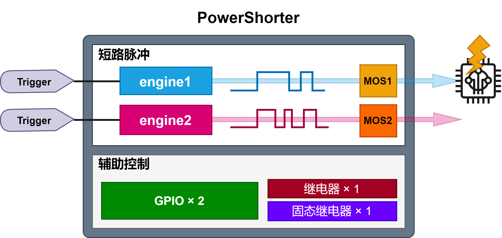

# 开箱

贴两张设备实物图，收纳包中有一个 PowerShorter 本体，一排杜邦线及一根 Type-C 数据线

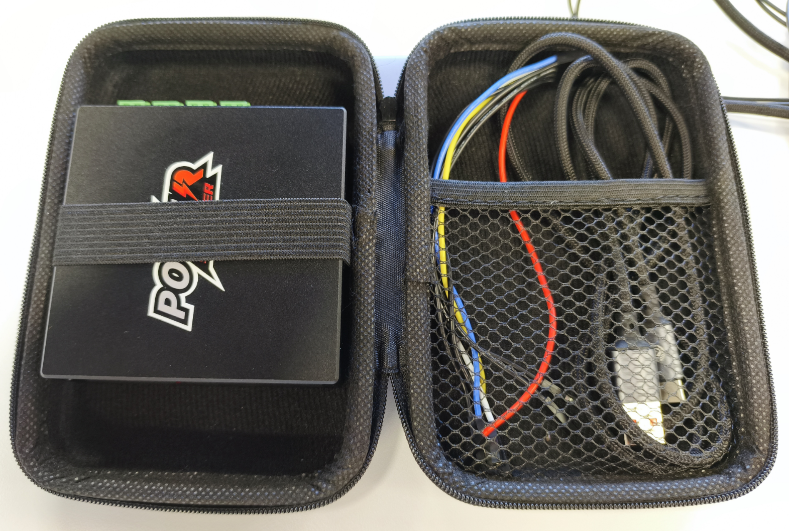


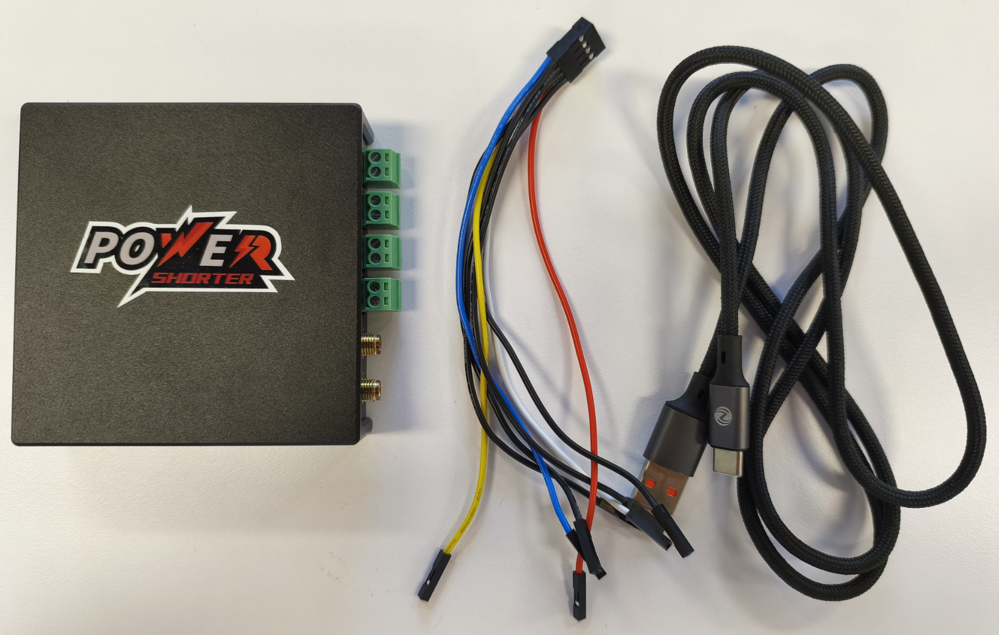


一侧是 Type-C 接口及杜邦线排针，这一侧主要负责控制 GPIO 输出及触发引脚

其中 E1-Tri 和 E2-Tri 分别对应了短路引擎 E1 和 E2 的触发引脚；IO1 和 IO2 即为 GPIO 输出，可用来作为触发或供电 

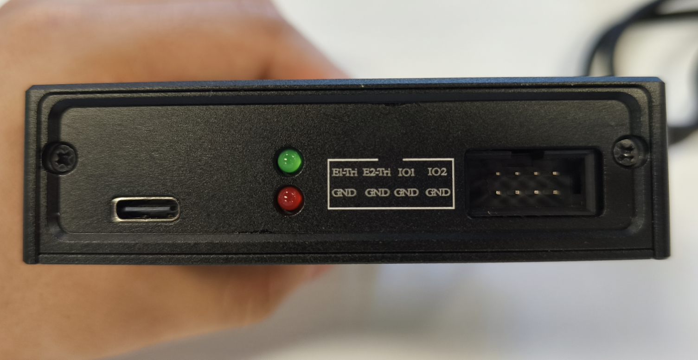


另一侧中的 Relay1 是固态继电器，Relay2 是电磁继电器，可以用来控制目标设备的重启复位等逻辑；E1 和 E2 是短路引擎做短路的位置，在实际操作中需要把目标设备的核心供电引脚接到 + 标记的位置，目标设备的 GND 接到 - 标记的位置（当然 - 这个位置和 PowerShorter 的 GND 是相连的，因此目标设备 GND 引脚与 PowerShorter GND 连接后也可以不接这个位置）；SMA-E1 和 SMA-E2 是用来观察短接毛刺使用的

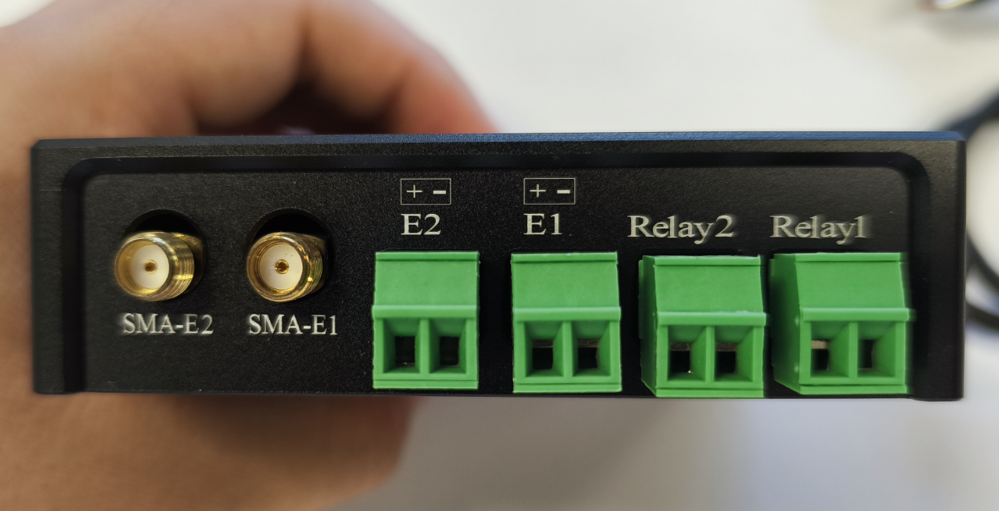


其中的插线端子可以取下，这样就可以直接插杜邦线了，省了一个螺丝刀，但遇到质量不好的杜邦线就不如插线端子稳定了，大家看情况选择吧

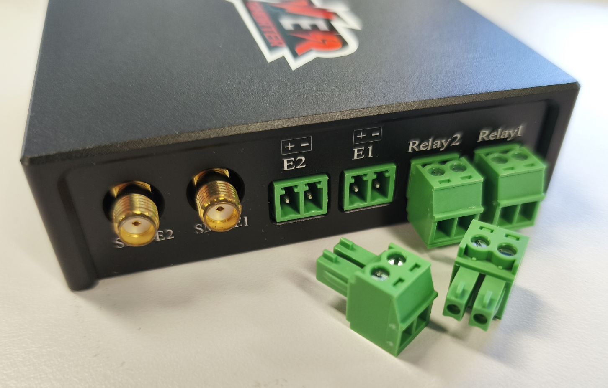


# Python 库

设备使用 Python 进行控制，控制脚本在 gitee 开源了，地址如下：

[深圳市纽创信安科技开发有限公司/powershorter](https://gitee.com/osr-tech/powershorter)


点击此处的发行版就可以下载 .whl 文件，使用 pip 进行安装

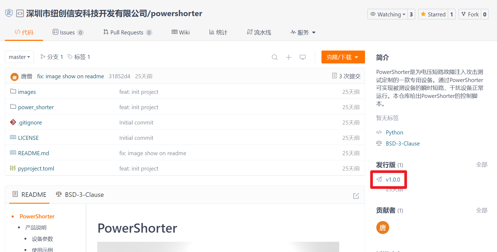


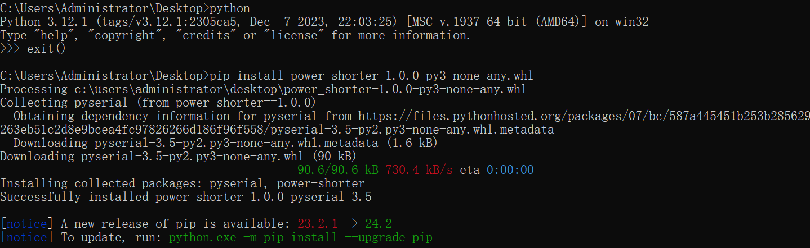


# 简单使用

对于打故障来说，我更习惯于使用 jupyter lab 这个交互式的运行环境，所以我还要装一下 jupyter

```plain
pip install jupyter
```


安装完成后就可以在终端中输入`jupyter lab`这条命令，正常情况下会自动打开浏览器窗口，如果你电脑做了什么设置无法打开的话可以在浏览器手动访问 URL

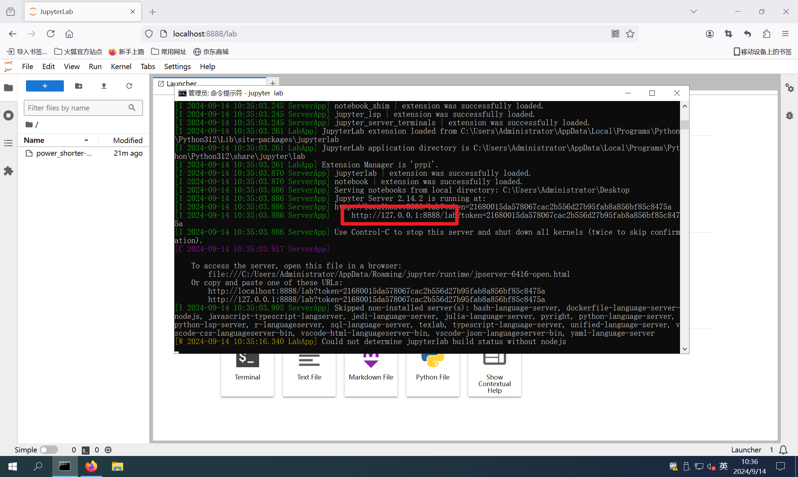


点击新建一个 Notebook

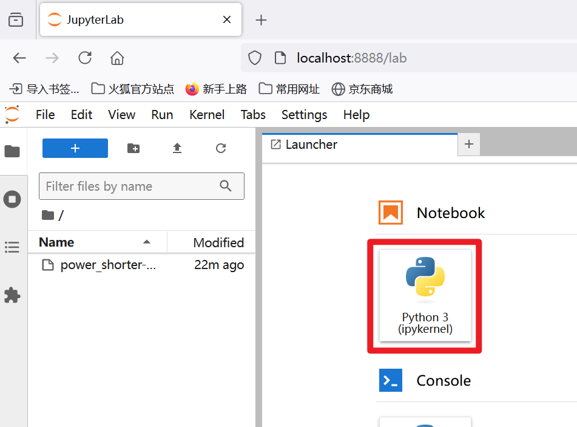


## 导入设备库

然后就可以执行 Python 代码了，首先导入控制代码库：`from power_shorter import *`

然后需要初始化设备，因为控制脚本是通过串口与 PowerShorter 进行通信的，因此初始化时需要指定串口号，可以在设备管理器中找到一个 CH340 的串口设备（若识别不到需要安装 CH340 串口驱动：https://www.wch.cn/products/CH340.html）

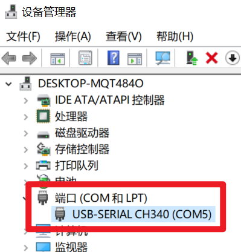

## 初始化设备

在 jupyter 网页环境中点击菜单栏的开始按钮就可以一条一条的执行代码，代码前面的中括号如果是星号 [ * ] 表示正在执行，如果是数字表示已经执行过了，如果是空的表示没有执行

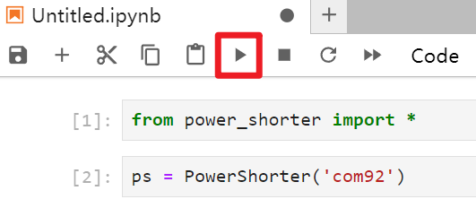


可以通过 tab 键查看提示

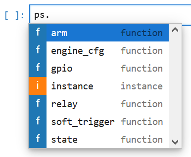 


在函数上按 shift+tab 键查看函数注释

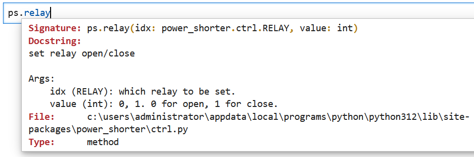


## 控制继电器

设备经过初始化后就可以做各种操作啦，  如果想要控制电磁继电器的话可以使用 RELAY2，执行这两条语句后会听到啪嗒啪嗒的声音，这就是电磁继电器吸合的响动

```plain
ps.relay(RELAY.RELAY2, 1)  # 电磁继电器接通
ps.relay(RELAY.RELAY2, 0)  # 电磁继电器断开
```

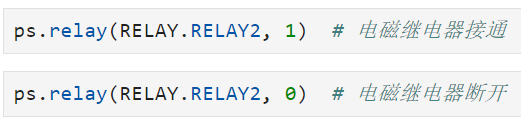


控制固态继电器通断只需要修改为 RELAY1 即可

```plain
ps.relay(RELAY.RELAY1, 1)  # 固态继电器接通
ps.relay(RELAY.RELAY1, 0)  # 固态继电器断开
```

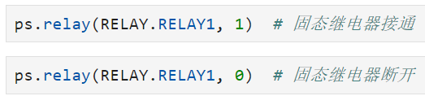


## 控制GPIO

同理，控制 GPIO 的方式是：

```plain
ps.gpio(GPIO.GPIO1, 1)  # GPIO1拉高
ps.gpio(GPIO.GPIO1, 0)  # GPIO1拉低
ps.gpio(GPIO.GPIO2, 1)  # GPIO2拉高
ps.gpio(GPIO.GPIO2, 0)  # GPIO2拉低
```

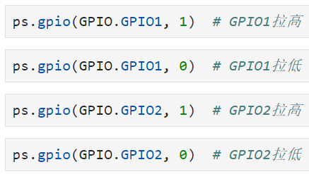


## 配置短路引擎

接下来介绍一下故障注入最重要的参数控制，延时和毛刺宽度的配置，在 PowerShorter 中，使用 engine_cfg 来进行配置

```plain
ps.engine_cfg(Engine.E1, [(0, 3000), (1, 200), (0, 1)], TRIGGER_MODE.RISE, 1, 1)
```

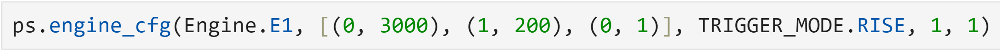


解释一下各个参数，首先需要指定配置的短路引擎，这里配置为 E1

然后通过一个参数列表来配置毛刺的延时和宽度，列表里面元组的第一个值 0 表示断开、1 表示短接；第二个值表示保持时间，单位是 10ns

例如这里的 [(0, 3000), (1, 200), (0, 1)] 就表示收到触发信号后，保持断开状态 3000 * 10ns，然后短接 200 * 10ns，最后保持断开 1 * 10ns，如果后续不再操作将一直保持断开状态。这背后实际是控制 MOS 管对 E1 的 + 和 - 进行断开或短接，从而实现电压短路故障注入

后面三个参数分别是：

配置触发边沿是上升沿还是下降沿（默认为上升沿触发，可以不填写）

毛刺参数的重复次数，可以重复执行参数列表中配置的毛刺（默认配置为 1，可以不填写）

毛刺边沿检测次数，可以配置检测到多次边沿再触发毛刺（默认配置为 1，可以不填写）


那再回头看我们配置的参数，整体的含义是：配置短路引擎 E1 的触发引脚（E1-Tri）检测到上升沿后先等 3000 * 10ns，再拉一个 200 * 10ns 的短路毛刺，然后保持断开


配置完毛刺的参数后需要使用 arm 函数激活毛刺，可以使用 state 函数查看当前状态，armed 表示毛刺已经被激活了，正在等待触发，同时设备红色的 LED 灯会熄灭

```plain
ps.arm(Engine.E1)
ps.state(Engine.E1)
```

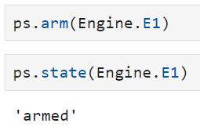


此时如果用杜邦线将设备的 GPIO1 和 E1-Tri 连接，然后将 GPIO1 拉高提供一个上升沿将毛刺触发，再看毛刺的状态就已经是 glitched 表示已经毛刺已经打出去了，E1 的 + 和 - 做了一次 200 * 10ns 的短路，红灯也又亮了起来

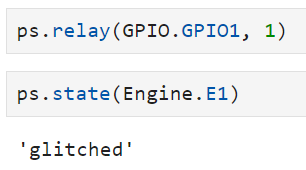


## 统计故障参数

对于故障注入来说，统计故障参数及结果是很有必要的，这样我们可以有参考的调整参数，统计结果可以使用 FaultViz 这个库

[深圳市纽创信安科技开发有限公司/FaultViz](https://gitee.com/osr-tech/faultviz)


这个库的使用需要配置 JAVA 环境，具体配置网上搜吧不细说了，安装完成后直接导入库，启用服务时需要指定端口（默认为 12345，可以不填写）

```plain
faultviz.start_view_service(port=12345)
```


然后通过 faultviz.ViewWidget() 创建一张表

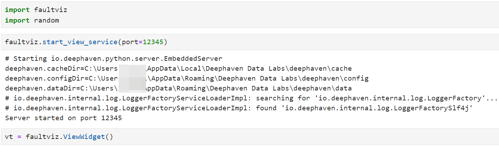


vt.update() 往表里添加数据，这里面的数据完全是由你自己定义的，键值对的形式，键会作为列名，值会放在表中作为数据，执行过第一次 update() 函数后表中才有了实际数据，这时候就可以使用 vt.show() 查看记录了，可以对数据进行筛选、排序、导出等操作

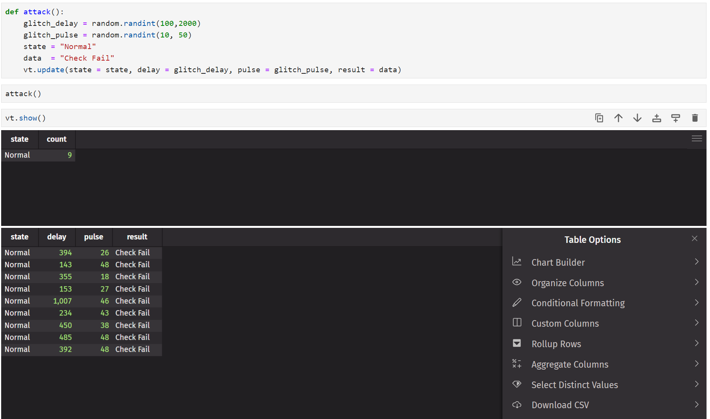
